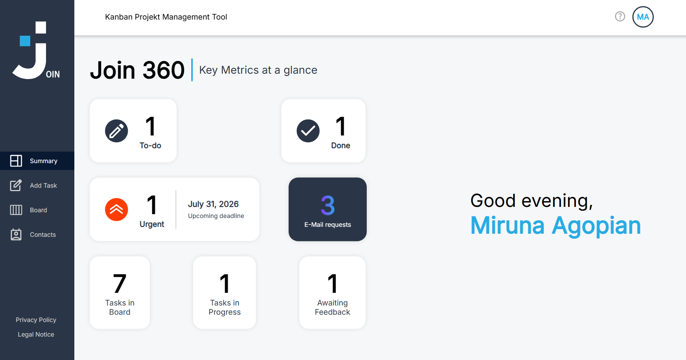

JOIN

_A Kanban board application designed to track tasks and subtasks and assign them to contacts. Create your own account, log in, save your contacts and create and manage tasks in your team._

<div align="center">
  
</div>

**Features**
- Test out the application as a guest or sign up to enjoy the full features
- Get a quick overview in the summary page about the tasks in board
- Add contacts and manage your contact list in the dedicated section
- Create tasks, move them across stages (To Do, In Progress, Awaiting feedback, Done)
- Assign contacts for each task, add multiple subtasks and mark them as done
- **Receive automated email notifications powered by N8N when a task changes status**
- **Write an email to the JOIN automation inbox and automatically create a new ticket via AI analysis**
- **Enjoy seamless backend automation for task updates, creator detection, and workflow triggers**

**Technologies used**
-  HTML
-  CSS
-  JavaScript
-  Firebase
-  N8N (workflow automation & e-mail notifications)

**How to get started**
You'll need:
-  a modern web browser
-  a code editor, like Visual Studio Code

**Clone the repository**
git clone https://github.com/MirunaAgopian/JOIN-2

**Project structure**

JOIN
```
├── index.html
├── script.js
├── style.css
├── html/
    └── add-task.html
    └── board.html
    └── contacts.html
    └── help.html
    └── legal-notice-login.html
    └── legal-notice.html
    └── login.html
    └── privacy-policy-login.html
    └── privacy-policy.html
    └── signup.html
    └── summary.html
├── styles/
    └── add-task-interactions.css
    └── add-task-standard.css
    └── add-task.css
    └── board.css
    └── boardAddTask.css
    └── boardEditTask.css
    └── boardShowTask.css
    └── contact-show.css
    └── contacts-dialog.css
    └── contacts-overview.css
    └── contacts.css
    └── help.css
    └── legal-notice.css
    └── login.css
    └── navigation.css
    └── privacy-policy-login.css
    └── privacy-policy.css
    └── signup.css
    └── summary.css
│ 
├── scripts/
│   └── add-task-visuals.js
    └── add-task.js
    └── board-design.js
    └── board-subtask.js
    └── board-tasks.js
    └── board.js
    └── contacts-dialog.js
    └── contacts-overview.js
    └── contacts.js
    └── firebase.js
    └── greeting.js
    └── help.js
    └── login.js
    └── navigation.js
    └── signup.js
    └── summary.js
    └── templates.js
├── n8n
    └── JOIN - Error Trigger.json
    └── JOIN - Main workflow.json
    └── JOIN - Ticket status changed.json
└── License
└── gitignore
└── README.md
```
**License**

This project is licensed under the MIT License — see the LICENSE file for details.

**Acknowledgements**

This project was built as a team project from a group of three Frontend-Developers studying at the Developer Akademie. 
